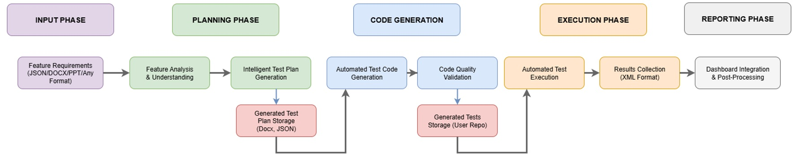
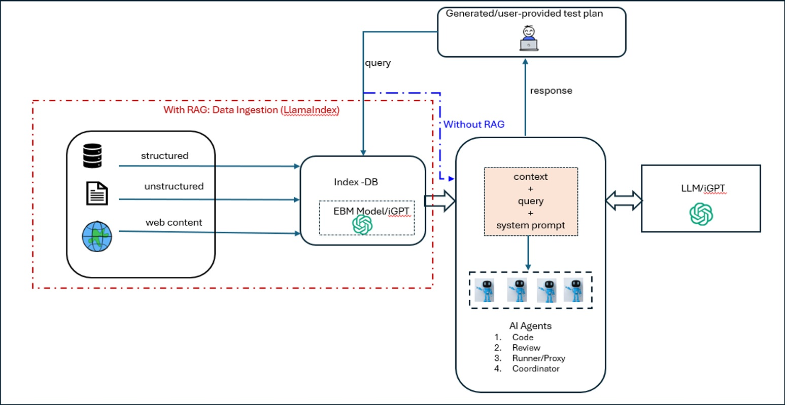

#  ValGenAgent

ValGenAgent is a **RAG-powered, AI agents based pipeline** for automated:
- Test plan generation (in doc/json format).
- Test case generation (in .py/.cpp/.c/.s etc) using generated test plan or user provided test plan.
- Execution of test cases on target platform (HW/Simulator)

It simplifies software validation workflows by generating test plans (from feature input files), generating
the test cases and, executing tests cases on target device. The pipeline uses existing source code, documents,
public URLs to create a vector index which provides context to LLM (GPT-4o) for better code genetion.
It provides flexibility to user to selectively use all three or single execution flow.

Note: The pipeline uses iGPT tokens (provided by Intel IT) for embedding and inference hence it is completely safe to use even with your proprietary code.

Please check the following resources for iGPT access:
- IGpt API Access: https://wiki.ith.intel.com/display/GenAI/Requesting+Access
- Internal API Access: https://api-portal-internal.intel.com/my-apps
- Getting started: https://wiki.ith.intel.com/display/GenAI/Using+the+Inference+API

LlamaIndex and autogen are used for pipeline creation.

---

##  Features

-  RAG-Based Test Plan Generation
-  RAG-Based Test Case Generation
-  Code Review is done by Agent
-  Test Case Execution on target device (HW/Simulator) by Agent
-  Test reports are generated with full details
-  Supports source code (c/cpp/python/assembly) + Documents (docx/pptx/pdf etc.) + Pulic URLs as inputs for richer context
-  Langugae aware and Hierarchical parser
-  Context-aware retrieval Pipeline

---

End-to-End pipeline



---

Testcase generation workflow




---

##  Input Support

ValGenAgent can consume source codes (c/cpp/python/assembly), documents (docx/pptx/pdf etc.) files,
and public URLs (un-restricted access) as inputs for richer context while creating test plan and test codes.

###  It supports language aware parser for the folowing Coding Languages

- `C`
- `C++`
- `Python`
- `Assembly`
- Other languages are parsed using a **HierarchicalNodeParser**. More language support is in progress.

###  Supported file formats

ValGenAgent uses [`SimpleDirectoryReader`](https://docs.llamaindex.ai/en/stable/module_guides/loading/simpledirectoryreader/) from LlamaIndex, and supports:

- `.txt`, `.md`, `.py`, `.c`, `.cpp`, `.s`, `.json`, `.docx`, `.xlsx`, `.pptx`, `pdf`, etc.
- Unsupported file will be treated as plane text

---
## Where to keep inputs (codes/docs/public_urls etc.) ?
All inputs should be kept in this `input_dirs` directory as follows:

```
input_dirs/
├── code/              # Source code files (C, C++, Python, etc.)
├── docs/              # Supporting documents (e.g., .txt, .md, .pdf)
└── public_urls.txt    # Public URLs for RAG context
```

##  Output Directory Structure

All outputs (plans, scripts, logs) are saved under user provided directory name ex: `test_results/` as follows:

```
test_results/
├── test_plan.docx
├── test_plan.json
├── generated tests/
│   ├── test_results.xml
│   └── test_operations.py
│   └── test_chat_log.txt
└── function_test_results.xlsx
```

---

##  Command-Line Usage

Following are the steps to use it:

###  Initial Setup

1. **Prepare Target Hardware/Simulator env**
   - If you are using Gaudi, ensure you have 8-card Gaudi container up and running.
   - For any other system, connect to the targer machine.

2. **Clone the Repository**
   ```bash
   git clone https://github.com/mansi05ag/ValGenAgent.git
   cd ValGenAgent
   ```

3. **Install Dependencies**
   ```bash
   pip install -r requirements.txt
   ```

---

###  Prepare input directory

Put your code, docs, and public urls inside the `input_dirs`. Alternatively, create a softlink accordingly.

---

###  Create feature input file in .json format
```
This is the prompt/instruction file used to generate test cases.
    The feature input file should contain:
    {
      "name": "Feature Name",
      "description": "Detailed feature description..."
    }

Please refer feature_description/collective_feature.json
```
---

###  Run the Agent

```bash
python test_runner.py --feature_input <path_to_input_file> --output_dir test_results
```

---

###  other example command

```bash
# Just generate test cases - don't run them
python test_runner.py --feature_input input_file/collective_feature.json --output_dir test_results --execute_tests=false

# Generate just the test plan based on the input file
python test_runner.py --feature_input input_file/collective_feature.json --generate_plan-only --output-dir test_results

# just generate tests based on user provided test plan
python test_runner.py --test_plan path/to/plan.json --output_dir path/to/output_dir --execute-tests=false
```

---

##  Use cases

This application supports various types of execution plans. Depending on the requirement, you can either:
- Only create the test cases
- Only generate the test plan
- Run the complete End-to-End workflow - test plan generation, test code generation, and execution


## Web based

We provide a user interface to use this tool. It offers simple interactive UI that has currently support what we user can do using command line.

### Steps to start the application:
1. First clone the repo on your personal vm
   ```bash
   git clone https://github.com/mansi05ag/ValGenAgent.git
   cd ValGenAgent
   pip install -r requirements.txt
   ```
2. Now go inside the directory webapp
   ```bash
   cd webapp
   ```
3. After that run the application
   ```bash
   python app.py
   ```
5. Access the application using port no. 8002 through url.


#  How to Use the web application

Steps to run the application using UI:

---

##  Step 1: Connect to the Target Container or Device

- Click the **Connect** button on your virtual machine (VM) interface to initiate the container setup.
- This will establish a connection to the required container or device.

- If you're working with an **`hlctl` container** in the **`qa` namespace**, you can also connect manually using the following command:

  ```bash
  hlctl container exec -w <container_name> bash -n qa
  ```

  >  Replace `<container_name>` with your actual container name.

> **Note:** The *Container Name* input field is relevant **only if you're using an `hlctl` container with the `qa` namespace**.

---

##  Step 2: Upload Files and Select Functionality

- Upload all required files.
  - Your **code and documentation** should be combined into a **single `.zip` file**.
- Choose the functionality you want the application to perform from the available options.
- Click the **Run** button to start execution.

>  The application will now run on the connected container or device, and you’ll see real-time output and logs on the screen.

---

##  Step 3: Download the Output

- Once execution completes successfully, a **ZIP file** containing the **generated output or results** will be available.
- Click on the **Download** button to save the output to your system.

---